<div align="center">

# stouchi

**A household budget app that answers one question: *what can I still spend?***

A mobile-first PWA for Tunisian households, with an AI assistant that logs expenses in plain words.
Product design, UX/UI, and full-stack engineering: a case study.


<br>

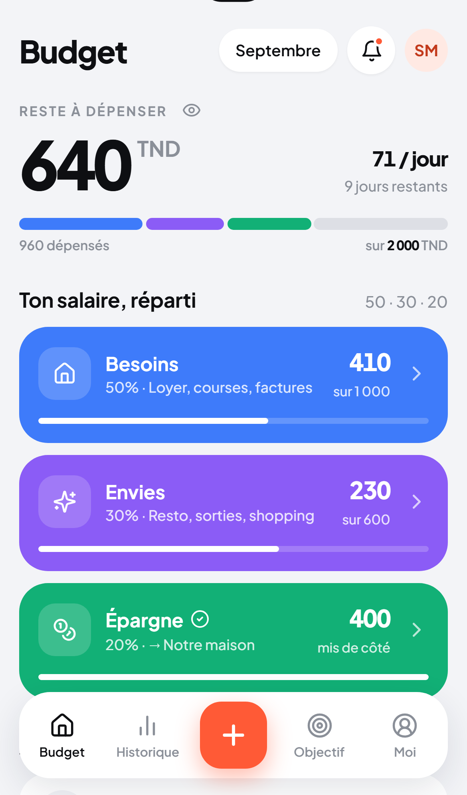&nbsp;&nbsp;
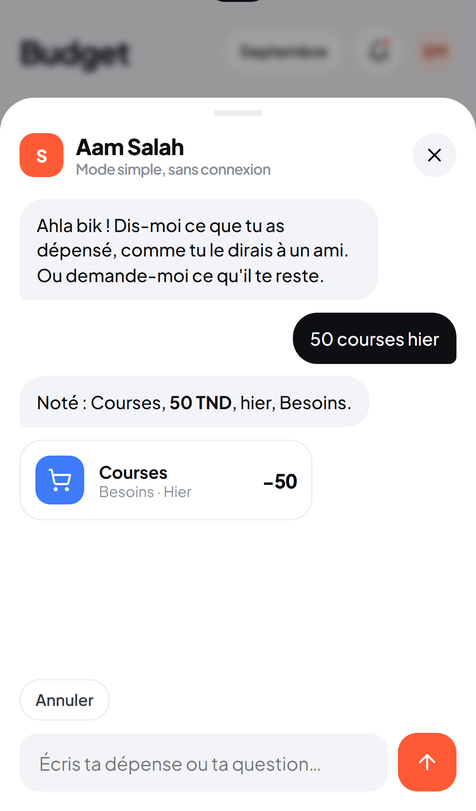&nbsp;&nbsp;
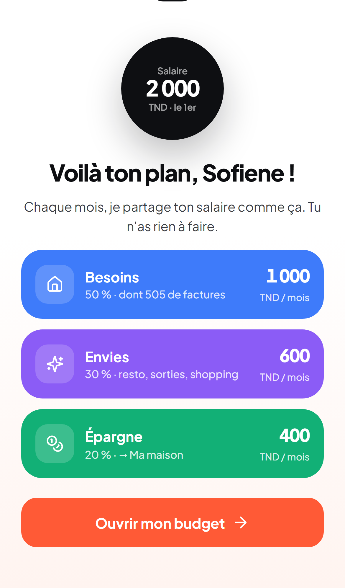

</div>

---

## At a glance

| | |
|---|---|
| **Role** | Solo: product strategy, user-feedback synthesis, UI and design system, front-end, back-end, data migration, QA |
| **Problem** | An existing budget app that its users found overwhelming: 12 destinations, 2 competing ways to add an expense, a 5 400-line `app.js` |
| **Outcome** | A full rebuild around one number, *Reste à dépenser*, with 5 tabs, logging in under 5 seconds, and an assistant that can act on the budget but never does maths itself |
| **Stack** | Vite · TypeScript (strict) · Preact + Signals · Supabase (Postgres, RLS, Auth, Realtime, Edge Functions) · Cloudflare Pages · Gemini |
| **Scale** | ~14 000 lines of app code · ~17 000 lines of tests · 18 design-system components · 13 migrations · 758 UI strings |
| **Quality** | 1 167 unit and component tests · 91 E2E tests on iPhone 13 and Pixel 7 · axe accessibility checks · 28-case assistant eval gate |

---

## 1. The problem

The first version of the app worked, but people did not *enjoy* it. Feedback from its users
surfaced four problems:

1. **Too many places to go.** Twelve destinations, grouped by how features were built, not by what
   people wanted to do.
2. **Two competing ways to add an expense**, and neither was fast.
3. **A look that read as "AI-generated"**: generic gradients, trust pills, a loading screen for nothing.
4. **An assistant that felt defensive.** Its 200-line prompt was a stack of patches, and it made the
   assistant robotic and sometimes wrong with numbers.

## 2. The one job

Every redesign decision was tested against a single sentence:

> **Open the app → know what you can still spend.**
> Every screen either answers that, explains it, or helps change it.

The money model behind it is simple on purpose: on payday the salary splits itself into three pots,
**Besoins 50 % · Envies 30 % · Épargne 20 %** (needs, wants, savings). Bills are reserved inside
Besoins. *Reste à dépenser* is what is left in Besoins + Envies.

### Goals I committed to

| Goal | Target |
|---|---|
| First-time setup | under **2 minutes** (5 questions) |
| Logging an expense | under **5 seconds**, by keypad or by chat |
| Finding any past expense | under **10 seconds**, searching across all months |
| Couple sharing | optional; it **never changes the core screens** |
| Bad connection | the app keeps working and **never loses an expense** |

What I deliberately left out: bank connections, multi-currency, investment advice, the shopping list
and the guided tour. Each one would have diluted the one job.

---

## 3. Information architecture: 12 destinations → 5 tabs

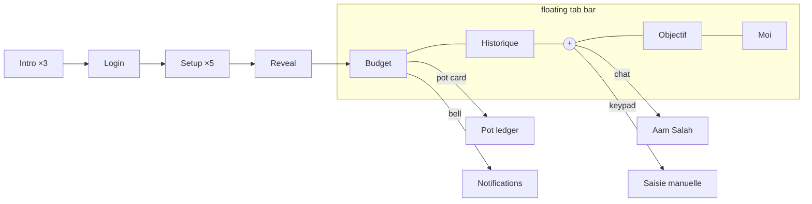

| Place | The question it answers |
|---|---|
| **Budget** | What can I spend? |
| **Pot ledger** | Where did this pot's money go? |
| **Historique** | What happened, and when? |
| **Objectif** | When do I reach my goal? |
| **Moi** | Settings, sharing, export, account |

**Removed:** the shopping list, the guided tour, the notifications drawer, a week strip, trust pills, a
fake loading screen, a separate Envelopes tab and an "Ensemble / Moi" toggle. Removing things was the
biggest UX win.

One subtle but important decision: **the budget period is the pay period, not the calendar month.**
If you are paid on the 25th, "this month" runs from the 25th to the 24th, and every figure, chart and
per-day amount follows that period.

---

## 4. Designing the flows

<table>
<tr>
<td width="33%" valign="top">
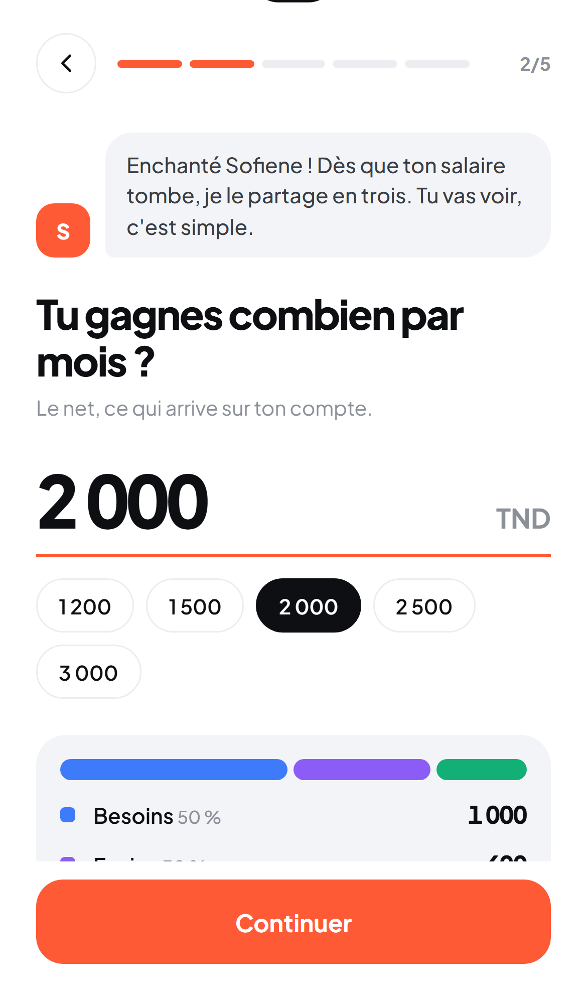<br>
<b>Setup in 5 questions.</b> Each question is asked by the assistant, one per screen, with a live preview: type your salary and watch the three pots fill.
</td>
<td width="33%" valign="top">
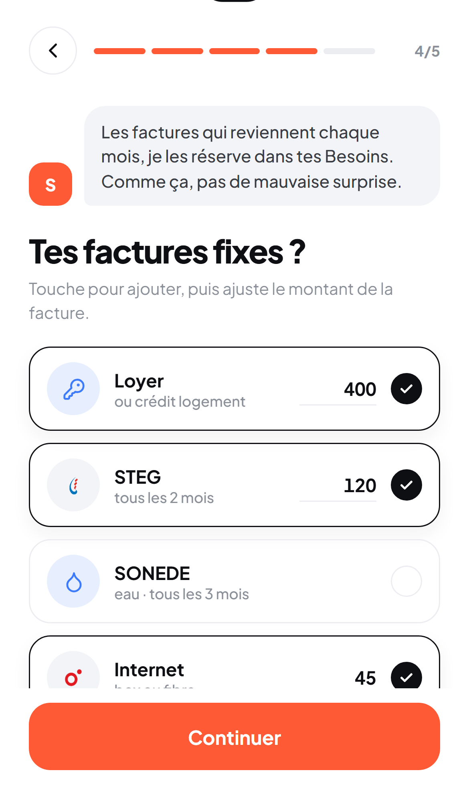<br>
<b>Fixed bills.</b> Toggle cards with editable amounts, and a meter that turns amber above 80 % of Besoins. The screen explains the problem instead of blocking you.
</td>
<td width="33%" valign="top">
<br>
<b>The reveal.</b> The salary coin splits into three pots with counting numbers and one burst of confetti. It is the moment the model clicks.
</td>
</tr>
<tr>
<td valign="top">
<br>
<b>Budget.</b> One huge number, a per-day figure and a four-colour split bar. The three pot cards carry the rest.
</td>
<td valign="top">
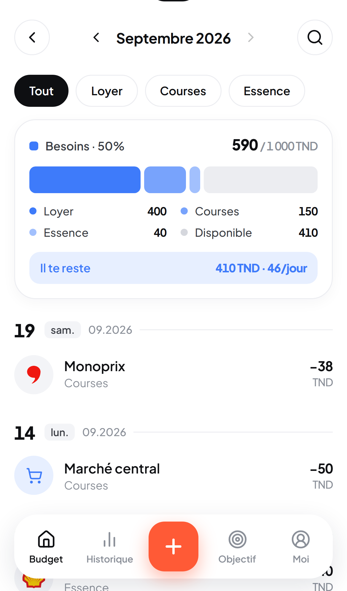<br>
<b>Pot ledger.</b> Category pills, a segmented summary bar and a flat list grouped by day. Category colours are tints of the pot colour, so Besoins always reads blue.
</td>
<td valign="top">
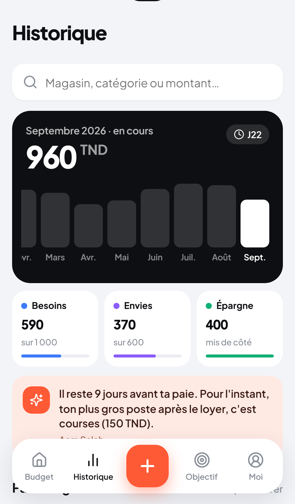<br>
<b>Historique.</b> A 12-month bar chart that doubles as the month picker, plus search across every month by shop, category or exact amount.
</td>
</tr>
<tr>
<td valign="top">
<br>
<b>Aam Salah.</b> "50 courses hier" becomes a receipt card with an Annuler chip. Edits and deletions go through a Oui / Non card.
</td>
<td valign="top">
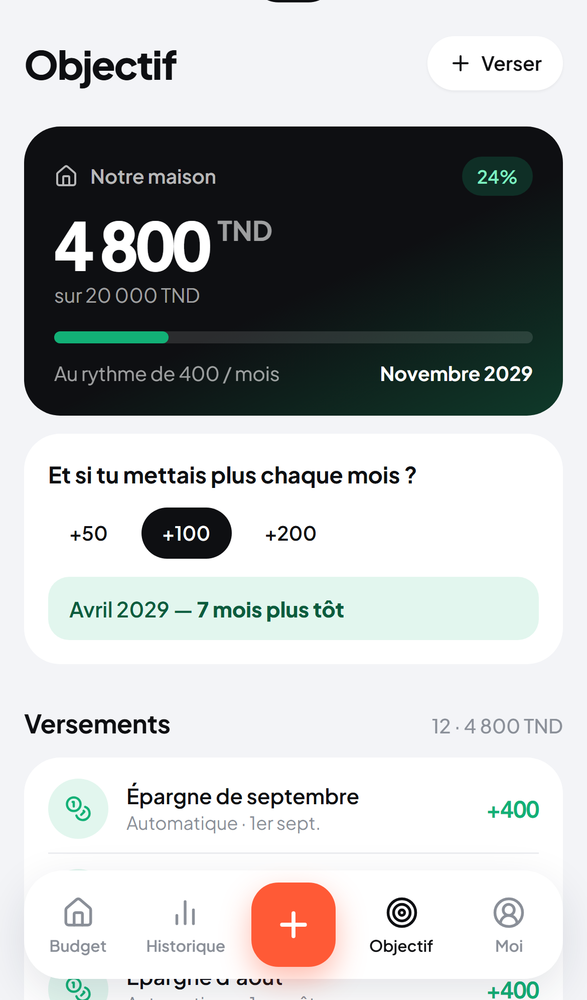<br>
<b>Objectif.</b> Saved vs target, a projected date, and "what if +50 / +100 / +200" to make saving more feel concrete.
</td>
<td valign="top">
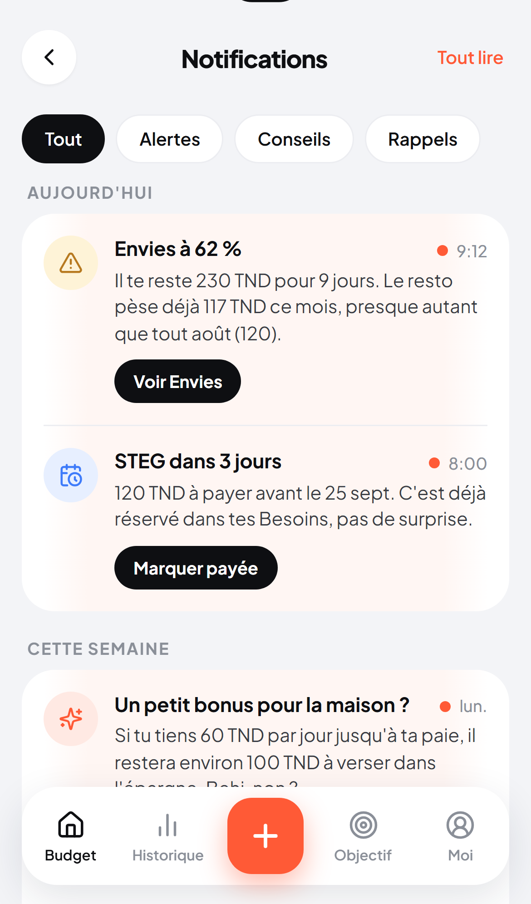<br>
<b>Notifications.</b> Every alert acts in one tap (Marquer payée, Voir Envies…). At most one a day, and never between 21:00 and 08:00.
</td>
</tr>
</table>

<sub>Screens are from the high-fidelity HTML prototype (<code>prototype/index.html</code>), which was the visual reference the app was built to match. It runs on demo data.</sub>

---

## 5. Design system

I designed the prototype first, then ported its markup and styles into components, rather than
redesigning while coding.

**Colour: one accent, three pots.**

| Token | Value | Role |
|---|---|---|
| `--acc` |  `#FF5A36` | The only accent: +, primary buttons, unread |
| `--need` |  `#3E7BFA` | Besoins (needs) |
| `--want` |  `#8B5CF6` | Envies (wants) |
| `--save` |  `#12B076` | Épargne (savings), money in |
| `--warn` |  `#F5A524` | 80 % thresholds |
| `--ink` / `--bg` |  `#0E0F12` /  `#F3F4F7` | Text / background |

Every colour used for text has a darker `*-ink` variant that meets **4.5 : 1 on white**.

**Type.** Plus Jakarta Sans. Numbers are the hero: weight 800, tight tracking (−0.045 em), tabular
figures, with the "TND" unit set smaller and raised. Amounts use `Intl.NumberFormat('fr-TN')` with
non-breaking thousands separators, so a number never wraps.

**Layout.** 8-pt grid, **one 16 px side gutter everywhere**, radii 24 / 18 / 12 px.

**Motion, with rules.**

| Pattern | Spec |
|---|---|
| Press | scale 0.95, 140 ms |
| Screen enter | children fade up 16 px, 45 ms stagger, `cubic-bezier(.2,.8,.2,1)` |
| Numbers | roll to their new value, 500–750 ms |
| Sheets | 320–340 ms slide |

All of it is switched off under `prefers-reduced-motion`, and **motion never delays input**.

**Accessibility (WCAG 2.1 AA).** 44 × 44 px touch targets, a label on every icon button,
`aria-selected` / `aria-pressed` / `aria-checked` on tabs, pills and toggles, focus trapped in sheets
and returned on close, live regions for chat replies and toasts, and no information carried by colour
alone. axe runs in every E2E test.

**Voice.** French only, informal *tu*, short sentences, with a Tunisian touch ("Ahla bik !"). All 758
strings live in one `fr.json`, with none hard-coded in components.

---

## 6. Aam Salah: an assistant that acts but never calculates

The assistant got the deepest rethink. The rule: **the model proposes, the app validates and executes.**

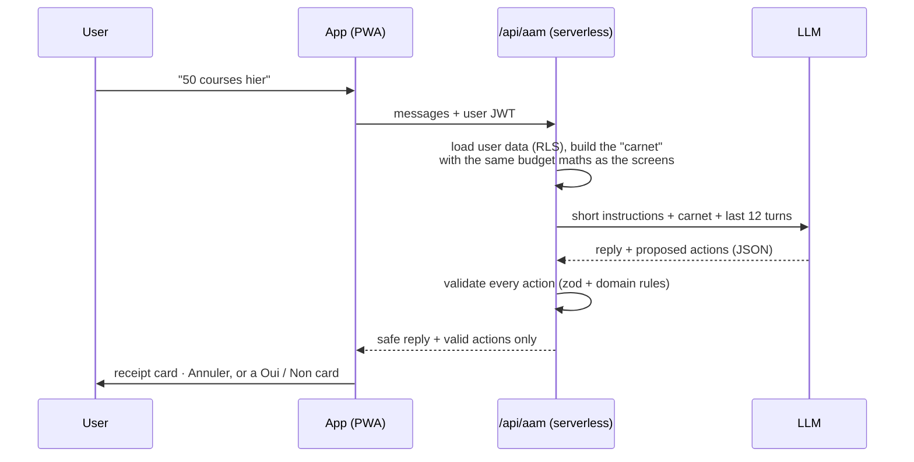

- **No arithmetic by the model.** Every figure it quotes comes from the *carnet*, a snapshot computed
  by the same code that draws the screens, so the chat and the UI can never disagree.
- **Actions, not just words.** It can add, edit and delete expenses, move money to savings, add bills,
  mark them paid, track debts, set reminders, open a screen, and undo.
- **Confirmation for anything destructive.** Edits, deletions and money moves go through a Oui / Non card.
- **Couple-safe.** It never edits a partner's expense; it proposes the change and notifies the partner.
- **Fails gracefully.** 12 s timeout → fallback model → a local French parser for simple expenses.
  Invalid JSON or invalid actions are dropped server-side and logged without any message text.
- **Measured, not guessed.** A 28-conversation eval set gates every prompt or model change (≥ 91.7 %).
  The current release passes **28 / 28**.

The instructions went from ~200 lines of patches to a short, principled brief that lives server-side.

---

## 7. Engineering

### Architecture

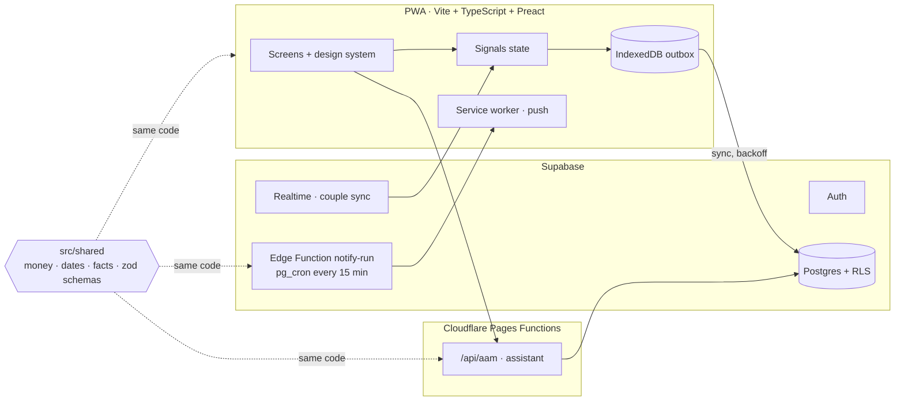

One shared package (`src/shared`) holds the budget maths, money helpers, pay-period dates and zod
schemas. The screens, the assistant and the notification job all import it, so there is **one source
of truth for every number**.

### Decisions that matter

| Concern | Decision |
|---|---|
| **Money** | Integer **millimes** (1 TND = 1 000). No floats anywhere, so rounding errors can't creep in. |
| **Time** | Everything in **Africa/Tunis**, bucketed by **pay period**, not calendar month. |
| **Offline** | Writes go to an **IndexedDB outbox** first and show instantly; sync replays with exponential backoff. Client UUIDs make every write idempotent. Target: zero lost expenses. |
| **Conflicts** | Last write wins per row on `updated_at`; Realtime pushes changes to the other device. |
| **Security** | **RLS forced on every table.** Server code runs with the *caller's* JWT, never a service key. CSP, HSTS and related headers. The assistant is rate-limited (30 turns / 10 min) and size-capped (32 kB). |
| **Notifications** | A Supabase Edge Function on `pg_cron` every 15 minutes, with rules, daily caps and quiet hours. Web push is opt-in, and never asked during onboarding. |
| **Couple mode** | An optional household layer: invite code, author avatars, a Tout / Moi filter, and the home figure becomes the household's. No other screen changes. |
| **Every state designed** | Every screen has loading (skeleton), empty and error states: no blank screens, no bare spinners. |

### Migrating real users' data

The rebuild replaces JSON documents with a relational schema, so existing households had to move over
without losing a millime. I wrote an **idempotent backfill** (`scripts/backfill`) that:

- converts amounts to millimes and dates to real `date`s, preserving ids through deterministic UUIDv5;
- turns legacy "épargne" expenses into deposits, so the goal balance equals the old `saved` exactly;
- **verifies before it writes**: per-source / month / pot totals must match, and invariants must hold
  (every bill and debt accounted for, one profile per account, balances equal);
- defaults to a dry run; `--apply` writes only when verification passes.

### Quality gates

| Layer | Tooling | Gate |
|---|---|---|
| Types, lint, format | TypeScript strict, ESLint (+ jsx-a11y), Prettier | CI fails on any error |
| Unit + component | Vitest, Testing Library | **1 167 tests**, **≥ 90 %** line coverage on `src/shared` (currently 99 %) |
| Database | PGlite (Postgres in-process) | RLS policies tested as each role |
| End-to-end | Playwright on **iPhone 13 + Pixel 7** | 91 tests: onboarding, logging, edit / delete / undo, search, offline then sync, couple mode with two browsers |
| Accessibility | axe in Playwright | No serious or critical violations |
| Assistant | 28-case eval | ≥ 91.7 % before any prompt or model change |

---

## 8. How it was built

The work was split into phases, each with a written plan (files, behaviour, tests) and a review before
moving on. The spec and every plan are in [`docs/superpowers`](docs/superpowers).

| Phase | Scope | Status |
|---|---|---|
| 0 · Foundations | Tooling, CI, tokens and components, schema + RLS, backfill, eval in CI | ✅ |
| 1 · Core budget | Budget, pot ledger, manual add, edit / delete, Historique + search, offline outbox | ✅ |
| 2 · First run | Intro, auth, 5-question setup, reveal, pay-period logic | ✅ |
| 3 · Aam Salah v2 | Server-side instructions and carnet, actions + confirmation cards, fallbacks, eval gate | ✅ |
| 4 · Notifications | Rules engine on a cron, in-app screen, web push opt-in | ✅ |
| 5 · Objectif & Moi | Goals and deposits, settings, export, account deletion | ✅ |
| 6 · Couple mode | Households, pairing, shared figures, partner requests | ✅ |
| 7 · Launch | Performance, accessibility pass, migration dry run, cut-over | ⏳ in progress |

---

## Run it locally

Requires Node ≥ 20.19 and a Supabase project (free tier is fine).

```bash
npm install
cp .env.example .env        # fill in VITE_SUPABASE_URL, VITE_SUPABASE_ANON_KEY, and GEMINI_API_KEY for the assistant
npm run dev                 # http://localhost:5173
```

To browse the design without a backend:

```bash
node scripts/dev-prototype.js   # http://localhost:8124  (add #app to skip onboarding)
```

| Command | What it does |
|---|---|
| `npm run check` | The full gate: format, typecheck, lint, unit tests with coverage |
| `npm run e2e` | Playwright on iPhone 13 and Pixel 7 (needs test accounts in `.env`) |
| `npm run eval` | The Aam Salah eval (needs `GEMINI_API_KEY`) |
| `npm run build` | Production build to `dist/` |

<details>
<summary><b>Project structure</b></summary>

```
src/
  app/          routing, shell, tab bar, sheets, toasts
  features/     budget · pot · history · goal · me · notifications · onboarding · chat · add
  design/       tokens.css and components (Button, Pill, Sheet, LedgerRow, SegmentedBar…)
  data/         Supabase client, repositories, outbox, sync
  shared/       money · dates · facts · schemas · i18n/fr.json   ← shared by client, server and cron
  server/       assistant turn handling, notification rules
functions/api/  aam.ts (Cloudflare Pages Function)
lib/aam-salah/  assistant instructions, action validation, eval fixture
supabase/       migrations/ and functions/notify-run
scripts/        backfill, Supabase checks, eval, prototype server
tests/          unit/ · db/ (RLS under PGlite) · e2e/ (Playwright)
prototype/      the clickable HTML prototype
docs/           product spec, assistant spec, phase plans
```

</details>

---

<div align="center">
<sub>Designed and built by <a href="https://github.com/Ruudgullit1920">@Ruudgullit1920</a> · Tunis, 2026</sub>
</div>
